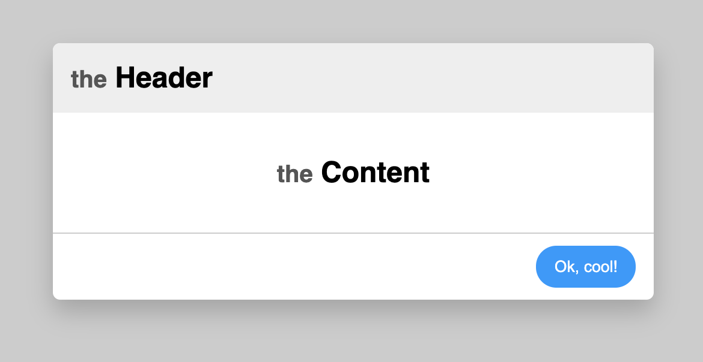

# lay-it-out

[](https://www.npmjs.com/package/lay-it-out) [](https://travis-ci.org/christianheyn/lay-it-out)

A helper for building complex react components with multiple child areas.

## Install

```bash
npm install --save lay-it-out
```

## Usage

Imagin you want to build a component like this:



And of course all the child elements are variable.
You could do it like this:


```jsx
import React from 'react'
import { withLayout, Place } from 'lay-it-out';

const Modal = ({ headerComponent, contentComponent, footerComponent }) => (
    <section className="modal">
        <header className="modal-header">
            {headerComponent}
        </header>
        <div className="modal-content">
            {contentComponent}
        </div>
        <footer className="modal-footer">
            {footerComponent}
        </footer>
    </section>
)

const App = () => (
    <Modal
        headerComponent={<h2><small>the</small> Header</h2>}
        contentComponent={<h1><small>the</small> Content</h1>}
        footerComponent={<button>Ok, cool!</button>}
    />
);
```

Or you are using lay-it-out
```jsx
import React from 'react'
import { withLayout, Place } from 'lay-it-out';

const _Modal = ({ children, child }) => (
    <section className="modal">
        <header className="modal-header">
            {child.header}
        </header>
        <div className="modal-content">
            {children}
        </div>
        <footer className="modal-footer">
            {child.footer}
        </footer>
    </section>
)

const Modal = withLayout(_Modal);

const App = () => (
    <Modal open>
        <Place toBe="header">
            <h2><small>the</small> Header</h2>
        </Place>

        <h1><small>the</small> Content</h1>

        <Place toBe="footer">
            <button>Ok, cool!</button>
        </Place>
    </Modal>
);

export default App;
```
___

## collision with prop name "child"
You can set an option object to prevent prop name collision of "child".
```jsx
// Layout.js
import React from 'react'
import { withLayout, Place } from 'lay-it-out';

const _Modal = ({ children, myCustomPropName }) => (
    <section className="modal">
        <header className="modal-header">
            {myCustomPropName.header}
        </header>
        <div className="modal-content">
            {children}
        </div>
        <footer className="modal-footer">
            {myCustomPropName.footer}
        </footer>
    </section>
)

const Modal = withLayout(_Modal, { customChildPropName: 'myCustomPropName' });
```

___

_Also tested with SSR (next.js). More test coming soon._

_If you tried this package with other SSR methods or with `react-native` , please let me know if it's work ;)_


## License

MIT © [christianheyn](https://github.com/christianheyn)
